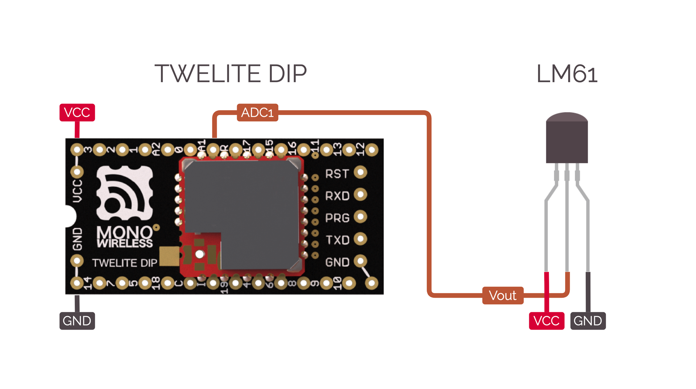

# ActEx\_Sns\_LM61

## はじめに / About

Tiのアナログ温度センサ LM61 (B/C) を使って気温を測定するサンプルです。
Act\_samplesのPAL\_AMBとしてデータを送信します。

Act sample for Ti LM61 (B/C) analogue temperature sensors.
Send data as PAL\_AMB in Act\_samples.

## 接続方法 / Connection



電源およびGNDを接続したうえで、LM61のVoutをTWELITEのADC1に接続します。

Connect powerlines, then connect the LM61 Vout to the TWELITE ADC1.

## 動作環境 / Environment

以下の環境でActの動作を確認しました。

- ソフトウェア
  - [MWSDK](https://mono-wireless.com/jp/products/stage/index.html) 2022年8月版 (macOS Monterey)
- ハードウェア
  - 自社製品
    - [TWELITE DIP BLUE (TWE-L-DI-W)](https://mono-wireless.com/jp/products/TWE-Lite-DIP/index.html)
    - [TWELITE R2 (MW-LITER2)](https://mono-wireless.com/jp/products/TWE-LITE-R/index.html)
  - 他社製品
    - LM61BIZ

This Act has been tested in the following environment:

- Software
  - [MWSDK](https://mono-wireless.com/jp/products/stage/index.html) 2022 August (macOS Monterey)
- Hardware
  - Own products
    - [TWELITE DIP BLUE (TWE-L-DI-W)](https://mono-wireless.com/jp/products/TWE-Lite-DIP/index.html)
    - [TWELITE R2 (MW-LITER2)](https://mono-wireless.com/jp/products/TWE-LITE-R/index.html)
  - Third-party products
    - LM61BIZ

## サンプルアクト / Act sample

`ActEx_Sns_LM61`は、このActに同梱しているMWX向けライブラリ `LM61` を使用したサンプルです。

基本的な動作は、`Act_samples`に収録の`PAL_AMB`と同一です。

ただし、`PAL_AMB`とは異なり、オプションでAQM1602を搭載した16x2行キャラクタ液晶に温度を表示できます。

`ActEx_Sns_LM61` is an Act sample using the included library `LM61`.

Basic behavior of this Act is same as `PAL_AMB` sample in the `Act_samples`.

However this Act can print temperatures in a optional 16x2 character LCD built with AQM1602 unlike the `PAL_AMB`.

## ライブラリ / Library

### 初期化 / Initialization

```C++:ActEx_Sns_LM61.cpp
    temp_sensor.setup(PIN_ANALOGUE::A1, 0.0f);
    temp_sensor.begin();
```

`setup()`では、計測に用いるADCポートのピンと、温度のオフセット値を設定できます。

`begin()`を呼ぶことで、計測を開始します。

In the `setup()`, you can set the ADC pin to use and the offset value of temperatures.

Call `begin()` to begin the sensing.

### 温度の取得 / Get temperature

```C++:ActEx_Sns_LM61.cpp
	if (temp_sensor.available()) {
		sensor.i16temp = temp_sensor.read_cent();
    }
```

`available()`で温度が取得できることを確認したあと、`read()` `read_cent()` あるいは `read_float()`で温度を取得します。

`read()`は`bool`型の正負（`.is_negative`）と`uint8_t`型の整数部（`.integer`）および小数部（`.fractional`）からなる`lm61_temperature_s`型の構造体を返します。

`read_cent()`は、温度を100倍した値を`int16_t`で返します。`read_float()`は、温度を`float`型で返します。

Get temperature with `read()`, `read_cent()` or `read_float()` after check availability with `available()`.

`read()` returns `lm61_temperature_s` struct: `.is_negative` (`bool`) describes the temperature is positive or negative, `.integer` (`uint8_t`) is integer part of the temperature and `.fractional` (`uint8_t`) is fractional part of the temperature.

`read_cent()` returns hundredfold temperature in `int16_t`. `read_float()` returns raw temperature in `float`.

```C++:LM61.hpp
struct lm61_temperature_s {
    bool is_negative;
    uint8_t integer;
    uint8_t fractional;
};
```

## ライセンス / License
MW-OSSLA-1 (MONO WIRELESS OPEN SOURCE SOFTWARE LICENSE AGREEMENT)
